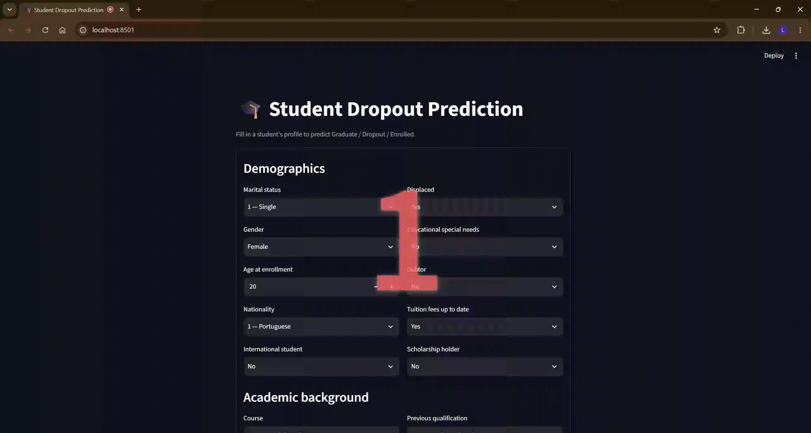
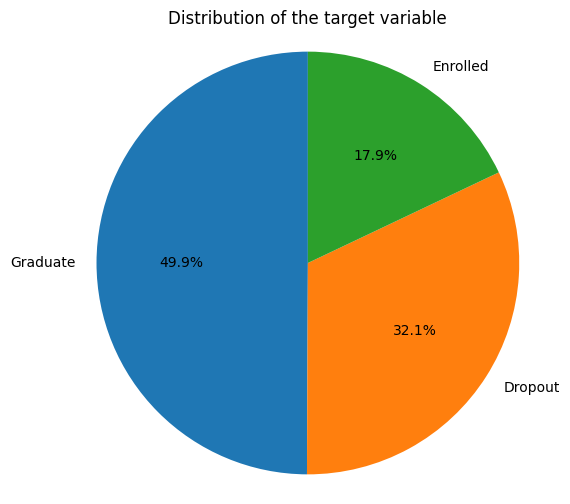
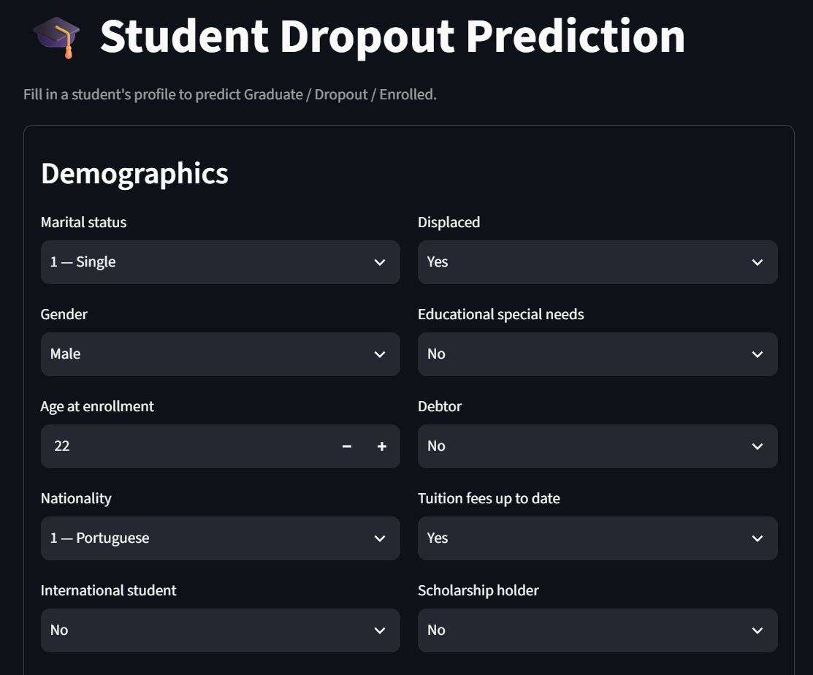

# 🎓 Student Dropout & Academic Success Prediction

> From an academic Machine Learning notebook to an end-to-end, production-oriented ML application.

[](https://www.python.org/)
[](https://scikit-learn.org/)
[](https://fastapi.tiangolo.com/)
[](https://streamlit.io/)
[](https://www.docker.com/)

<p align="center">
  
</p>

---

## 📋 Table of Contents
1. [Overview](#-overview)
2. [Academic Origin](#-academic-origin)
3. [Dataset](#-dataset)
4. [Architecture](#-architecture)
5. [From Notebook to Production: Key Improvements](#-from-notebook-to-production-key-improvements)
6. [Modeling Approach](#-modeling-approach)
7. [Results](#-results)
8. [Tech Stack](#-tech-stack)
9. [Project Structure](#-project-structure)
10. [Installation & Running](#-installation--running)
11. [Limitations](#-limitations)
12. [Ethical Considerations](#-ethical-considerations)
13. [References](#-references)
14. [Author & License](#-author--license)

---

## 🎯 Overview

This project predicts a student's final academic outcome — **Graduate**, **Dropout**, or **Enrolled** — from demographic, socioeconomic, admission, and academic-performance data. The prediction is made at the end of the second academic semester.

It started as an academic notebook and was rebuilt into a small but complete ML system: a reusable `scikit-learn` pipeline, a FastAPI inference service, a Streamlit frontend, and Docker packaging.

---

## 🏫 Academic Origin

This project began as a Machine Learning assignment completed during my exchange semester at the **University of Milan**, graded **30L/30** (highest grade in the Italian system).

The original notebook (`notebooks/ML_project.ipynb`) focused on exploration, feature selection, and model comparison. It's kept in this repo as an academic reference, but **the final application does not depend on it** — the notebook's logic was redesigned from scratch into modular, production-style code.

---

## 🗃️ Dataset

**[Predict Students' Dropout and Academic Success](https://archive.ics.uci.edu/dataset/697/predict+students+dropout+and+academic+success)** — UCI Machine Learning Repository, dataset #697.

- **4,424 students, 36 features**, from the **Instituto Politécnico de Portalegre (IPP)**, Portugal.
- Target: three-class outcome — `Dropout`, `Enrolled`, `Graduate`.
- Feature groups: demographics (age, gender, nationality), admission background (application mode, prior qualifications, admission grade), socioeconomic status (scholarship, tuition status, parents' occupation/education), 1st/2nd-semester academic performance (units enrolled/evaluated/approved, grades), and macroeconomic indicators (unemployment, inflation, GDP).
- No missing values; the dataset was already cleaned of major anomalies by its authors.

<p align="center">
  
</p>

Citation: Realinho, V., Vieira Martins, M., Machado, J., & Baptista, L. (2021). *Predict Students' Dropout and Academic Success.* UCI ML Repository. DOI: 10.24432/C5MC89. Licensed under CC BY 4.0.

---

## 🏛️ Architecture

```text
Streamlit (UI)  →  FastAPI (API)  →  sklearn pipeline (preprocessing + model)
```

The frontend sends the student's data to the API, which runs it through the serialized pipeline and returns the predicted class.

| Component | Role |
|---|---|
| `src/` | Preprocessing, feature selection, training |
| `models/` | Serialized pipeline (`final_pipeline.joblib`) |
| `api/` | FastAPI prediction service |
| `frontend/` | Streamlit interface |
| `tests/` | Unit tests |
| `notebooks/` | Original academic notebook (reference only) |

---

## 🚀 From Notebook to Production: Key Improvements

The production code is **not a direct packaging of the notebook**. The notebook is the academic baseline, and several parts of its methodology were changed when the project was refactored.

### What actually changed

The main production improvements are therefore methodological as well as architectural:

1. **The notebook's exploratory logic was made reusable.** Preprocessing and feature selection are implemented as sklearn-compatible transformers instead of notebook-only cells.
2. **Feature selection is made part of the training pipeline.** This avoids creating a production model from a feature list that was selected once in an exploratory notebook.
3. **The optimization target changes from accuracy to Macro F1.** This is important because the `Enrolled` class is smaller and harder to classify than the two other classes. Accuracy can hide poor performance on the minority class. Therefore, Macro F1 is used as the primary model-selection metric.
4. **Class balancing is extended to Gradient Boosting.** The production wrapper computes balanced sample weights because `GradientBoostingClassifier` does not expose a `class_weight` parameter.
5. **Hyperparameter search becomes two-stage.** A broad randomized search identifies a promising region, then a smaller grid refines it.
6. **The whole inference path is serialized together.** The API receives raw student features and uses the same fitted preprocessing, feature-selection, and model steps used during training.

---

## 🤖 Modeling Approach

Two ensemble models are compared, both handling class imbalance explicitly:

- **Random Forest** — robust to nonlinearities and heterogeneous tabular data, native `class_weight="balanced"` support.
- **Gradient Boosting** — strong on structured/tabular data, wrapped in a custom balanced-weighting class since `GradientBoostingClassifier` has no built-in `class_weight`.

Both are optimized via `RandomizedSearchCV` → `GridSearchCV` (5-fold stratified CV, scored on `f1_macro`), and selected on **Macro F1-score** rather than accuracy, since the `Enrolled` class (794 of 4,424 students) is notably harder to predict than `Dropout` or `Graduate`. Feature selection is evaluated internally with a separate 3-fold stratified CV.

## 📊 Results

Here are the results of both models :

| Model             | CV Macro F1 | Test Macro F1 | Test Accuracy |
| ----------------- | ----------: | ------------: | ------------: |
| Random Forest     |  **0.7233** |    **0.7348** |      **0.79** |
| Gradient Boosting |      0.7161 |        0.7185 |          0.77 |

**Random Forest** was selected as the final model based on the best cross-validated Macro F1.

### Final Model — Random Forest

```text
              precision    recall  f1-score   support

Graduate        0.83      0.92      0.87       427
Dropout         0.87      0.78      0.82       284
Enrolled        0.54      0.48      0.51       159

accuracy                            0.79       870
macro avg       0.75      0.73      0.73       870
weighted avg    0.79      0.79      0.79       870
```

The final model achieves a **Macro F1 of 0.7348** and an **accuracy of 0.79** on the held-out test set. The `Enrolled` class is the most challenging to predict, while `Graduate` achieves the strongest recall and F1-score.

---

## 🛠️ Tech Stack

| Library | Version | Role |
|---|---|---|
| `pandas` | 2.2.2 | Data manipulation |
| `scikit-learn` | 1.8.0 | Preprocessing, feature selection, models, pipeline |
| `joblib` | 1.3.2 | Pipeline serialization |
| `fastapi` | 0.141.1 | API |
| `streamlit` | 1.62.0 | Frontend dashboard |

Full list with pinned versions in `requirements.txt`.

---

## 📁 Project Structure

```text
student-dropout-prediction/
├── assets/
│   └── images/                    # Images used exclusively by the README
├── notebooks/
│   └── ML_project.ipynb          # Original academic notebook (reference only)
├── src/
│   ├── preprocessing.py          # Target encoding, RareCategoryGrouper, OneHotEncoder, data-quality fixes
│   ├── feature_selection.py      # Model-based feature selector, correlation pruning, BalancedGradientBoostingClassifier
│   ├── evaluate.py               # Macro-F1 / classification_report evaluation helper
│   ├── feature_defaults.py       # Computes per-feature medians/modes for the frontend form
│   └── train.py                  # Full training pipeline: CV, hyperparameter search, model export
├── api/
│   └── main.py                   # FastAPI app, Pydantic request/response models, and /predict endpoint
├── frontend/
│   ├── streamlit_app.py          # Streamlit dashboard
│   └── labels.py                 # Human-readable labels for the dataset's coded categorical fields
├── models/
│   ├── final_pipeline.joblib     # Serialized preprocessing + feature selection + model pipeline
│   └── feature_defaults.json     # Default values used to pre-fill the Streamlit form
├── tests/                        # Units tests
│   ├── test_preprocessing.py
│   └── test_api.py
├── data/
│   └── data.csv                  # Raw UCI dataset
├── Dockerfile                    # API container
├── Dockerfile.frontend           # Frontend container
├── docker-compose.yml            # Orchestrates API + frontend together
├── pyproject.toml                # pytest & ruff configuration
├── requirements.txt              # Core/API dependencies
├── requirements-dev.txt          # + testing/linting dependencies
├── requirements-frontend.txt     # Streamlit-only dependencies
└── README.md
```

---

## ⚙️ Installation & Running

### Clone the repository

```bash
git clone https://github.com/LoicSeba/student-dropout-prediction.git
cd student-dropout-prediction
```

### Run everything with Docker (recommended)

This starts the API and the Streamlit frontend together, already configured to talk to each other:

```bash
docker-compose up --build
```

- API: `http://localhost:8000` (interactive docs at `/docs`)
- Frontend: `http://localhost:8501`

<p align="center">
  
</p>

### Run locally without Docker

```bash
python -m venv venv
source venv/bin/activate  # Windows: venv\Scripts\activate

pip install --upgrade pip
pip install -r requirements.txt

# Terminal 1 — API
uvicorn api.main:app --reload --host 0.0.0.0 --port 8000

# Terminal 2 — Frontend
pip install -r requirements-frontend.txt
streamlit run frontend/streamlit_app.py
```

---

## ⚠️ Limitations

- **Generalization:** trained on data from a single Portuguese institution — not validated on other schools, countries, or time periods.
- **Class imbalance:** the `Enrolled` class remains the hardest to separate from the other two.

---

## 🔐 Ethical Considerations

This model is a **decision-support tool**, not an automated decision-maker. A predicted `Dropout` should be read as *"this profile resembles historical dropout patterns in this dataset"*, not as a statement about a specific student's future. It should never be used alone to deny opportunities, penalize students, or restrict access to scholarships.

---

## 📚 References

- Realinho, V., Vieira Martins, M., Machado, J., & Baptista, L. (2021). *Predict Students' Dropout and Academic Success.* UCI ML Repository. DOI: 10.24432/C5MC89.
- Martins, M. V., Tolledo, D., Machado, J., Baptista, L. M. T., & Realinho, V. (2021). *Early prediction of student's performance in higher education: a case study.*

---